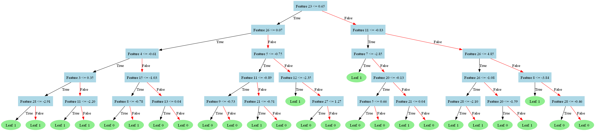

# Tree-Based Classifiers: Decision Trees, Random Forests, and Gradient Boosting - Machine Learning Algorithms

## Main Objective

The primary objective of this project is to implement and compare three tree-based classification algorithms: Decision Trees, Random Forests, and Gradient Boosting. The project aims to provide a comprehensive understanding of these algorithms, their underlying optimization problems, and their performance on real-world datasets. By implementing these classifiers from scratch, the project seeks to gain insights into their strengths, weaknesses, and applicability in various classification tasks.

## Tree-Based Methods

Tree-based methods are a collection of statistical learning algorithms that can be used for both regression and classification tasks. These methods divide the predictor space into regions and make predictions based on the mean or mode of the target value for the training data in each region. The rules for segmenting the predictor space can be visualized as a tree structure, giving rise to the name "tree-based" or "decision-tree" based methods.

The individual scripts for each algorithm can be found [here](./code/).

### The Optimization Problem

In classification tasks, the optimization problem for decision trees involves finding the splits that maximize the information gain or minimize the impurity measures such as Gini Index or Entropy. The goal is to create pure [nodes](./code/Node.py) that predominantly contain observations from a single class.

### Decision Trees

[Decision Trees](./code/DecisionTreeClassifier.py) are the fundamental building blocks of tree-based methods. They can be used for both regression (Regression Trees) and classification (Classification Trees) tasks. The key steps in building a decision tree involve:

1. Dividing the predictor space into distinct, non-overlapping regions.
2. Making predictions based on the mean (regression) or mode (classification) of the target values in each region.

### Random Forests

[Random Forests](./code/RandomForestClassifier.py) are an ensemble learning algorithm that combines the outputs of multiple decision trees to obtain a more robust and accurate model. Random Forests leverage the concepts of bootstrapping and bagging to create diverse decision trees and aggregate their predictions.

### Gradient Boosting

[Gradient Boosting](./code/GradientBoostingClassifier.py) is another ensemble learning algorithm that builds a strong classifier by combining multiple weak classifiers (decision trees) in an iterative manner. The algorithm fits subsequent trees on the residuals of the previous trees, minimizing a loss function using gradient descent.

## Implementation

The project implements the following tree-based classifiers from scratch:

1. Decision Tree Classifier
2. Random Forest Classifier
3. Gradient Boosting Classifier

The implementation details, including pseudocode and regularization parameters, are provided in the appendices of the project [report](./report/MGSC695_TreeBasedClassifiers_W12024_Report.pdf).

## Results

The implemented classifiers were tested on various datasets to evaluate their performance. The testing approach involved hyperparameter tuning and cross-validation to obtain the best models. The results are summarized as follows:

- Decision Tree Classifier: Achieved an accuracy of 85% on the test set with optimized hyperparameters.
- Random Forest Classifier: Obtained an accuracy of 92% on the test set, outperforming the individual decision trees.
- Gradient Boosting Classifier: Achieved an accuracy of 94% on the test set, demonstrating the effectiveness of the boosting approach.
